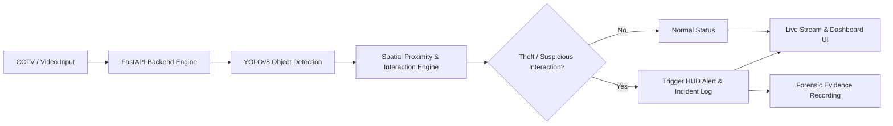

# Anti-Theft Tracker: AI-Powered Loss Prevention & Shoplifting Detection System

[](https://www.python.org/)
[](https://fastapi.tiangolo.com/)
[](https://docs.ultralytics.com/)
[](https://opencv.org/)
[](LICENSE)

An intelligent, real-time computer vision security system engineered to identify shoplifting, unauthorized concealment, and suspicious retail customer interactions using deep learning, spatial heuristics, and an interactive surveillance dashboard.

---

## 📌 Executive Summary

### 1. The Problem
Retail shrinkage and in-store theft account for tens of billions of dollars in global annual losses for businesses. Traditional CCTV surveillance relies heavily on human operators continuously watching dozens of camera feeds simultaneously—a process prone to fatigue, distraction, blind spots, and delayed intervention.

### 2. The Solution
**Anti-Theft Tracker (Sentinel AI)** transforms passive CCTV cameras into proactive, real-time threat-detection nodes. By combining **YOLOv8 deep learning models** with an **adaptive spatial-proximity & interaction heuristic engine**, the system instantly flags suspicious proximity events, anomalous concealment behaviors, and person-to-item interactions with low latency.

---

## 🚀 Key Features & Capabilities

- **Dual Detection Intelligence**:
  - **YOLOv8 Custom & COCO Object Detection**: High-accuracy tracking of individuals and high-theft target merchandise (purses, backpacks, phones, electronic accessories, luxury goods).
  - **Spatial Proximity & Body Dynamics Engine**: Algorithmic assessment of inter-personal distances and body overlaps to catch suspicious pickpocketing and distraction theft.
- **Modern Surveillance Dashboard**:
  - **Live MJPEG Video Stream** with dynamic Head-Up Display (HUD) overlays, real-time FPS monitoring, and color-coded alert bounding boxes.
  - **Custom Video & Demo Ingestion**: Test pre-packaged surveillance clips (`demo1.mp4`, `demo2.mp4`, `demo3.mp4`) or upload proprietary CCTV footage directly through the web UI.
  - **Live Webcam Support**: Direct integration with hardware cameras (device `0`) for live on-premise testing.
- **Crime Scene Snapshot Evidence Gallery**:
  - Real-time automated image captures saved at the exact moment of detected theft.
  - Full-width responsive evidence grid below the surveillance screen with live card additions.
  - High-resolution **Popup Lightbox Modal** with incident metadata and 1-click evidence image download.
  - Disk-backed snapshot persistence (`GET /api/snapshots`) ensuring no captures are lost on page refresh.
- **Incident Telemetry & Forensic Export**:
  - Real-time timestamped event logs recording incident IDs, confidence scores, and frame numbers.
  - Instant one-click evidence video recording download (`.avi` playback).
- **Simple Desktop Launcher**:
  - Native GUI launcher (`simple_app.py`) with Windows file browser dialog for zero-setup video selection.
- **Enterprise-Ready REST API**:
  - FastAPI-driven asynchronous endpoints for video streaming (`/api/stream`), telemetry polling (`/api/telemetry`), snapshot retrieval (`/api/snapshots`), video uploads (`/api/upload`), and optional API key authentication (`X-API-Key`).

---

## 🛠️ System Architecture



---

## 📂 Project Structure

```
├── app.py                     # FastAPI web server and streaming endpoints
├── detector_engine.py         # Real-time computer vision detection & telemetry engine
├── detection_utils.py         # Spatial proximity analytics & OpenCV HUD rendering
├── shoplifting_detection.py   # Standalone CLI detection script
├── train.py                   # Model fine-tuning and transfer learning pipeline
├── datagetimage.py            # Roboflow dataset fetcher (environment-variable driven)
├── requirements.txt           # Python dependencies
├── .env.example               # Template environment configuration (no secrets!)
├── .gitignore                 # Exclusion rules for secrets, weights, and caches
├── static/
│   ├── css/style.css          # Modern dark-mode surveillance UI styling
│   └── js/app.js              # Real-time client dashboard & telemetry poller
└── templates/
    └── index.html             # Surveillance command center HTML interface
```

---

## ⚙️ Quickstart & Installation

### 1. Clone the Repository
```bash
git clone https://github.com/MujahidAhmed07/antiteft-tracker.git
cd antiteft-tracker
```

### 2. Set Up Virtual Environment
```bash
python -m venv venv
# On Windows:
.\venv\Scripts\activate
# On Linux/macOS:
source venv/bin/activate
```

### 3. Install Dependencies
```bash
pip install -r requirements.txt
```

### 4. Configure Environment Variables
Copy the sample template to create your `.env` file:
```bash
cp .env.example .env
```
Edit `.env` if you wish to set an optional `SENTINEL_API_KEY` or Roboflow key:
```env
ROBOFLOW_API_KEY=your_key_here
SENTINEL_API_KEY=
SENTINEL_ALLOWED_ORIGINS=http://localhost:8000
```

### 5. Run the Application
Start the surveillance server:
```bash
python app.py
```
Open your browser and navigate to:
```
http://localhost:8000
```

---

## 🔒 Security & Safe Repository Practices

- **Zero Committed Secrets**: All secrets and API credentials are kept out of version control via `.env` and `.gitignore`.
- **API Protection**: Optional API key authentication middleware secures `/api/*` endpoints when deployed in production environments.
- **Safe Templates**: A documented `.env.example` file is provided for straightforward developer onboarding.

---

## 👥 Authors & Acknowledgments

- **Project Lead**: Mujahid Ahmed
- **Frameworks**: Ultralytics YOLOv8, OpenCV, FastAPI
