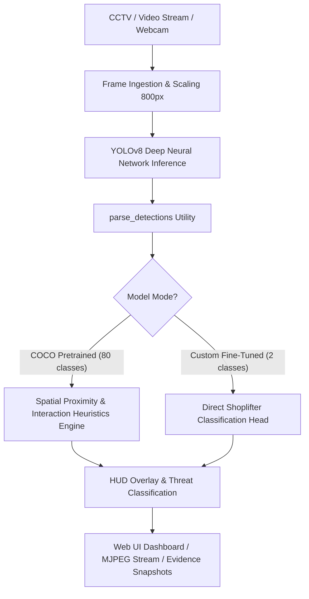

# YOLOv8 Computer Vision Architecture & System Integration Guide
## Sentinel AI: Autonomous Shoplifting & Loss Prevention Surveillance System

---

## 1. Executive Overview

This document provides a comprehensive technical reference for the **YOLOv8 (You Only Look Once v8)** object detection model and its specific architecture, data pipelines, spatial heuristics, and runtime optimizations within this **AI Shoplifting & Theft Detection System**.

In this surveillance platform, YOLOv8 serves as the primary **visual perception engine**, providing real-time spatial bounding boxes, class semantics, and confidence scores across video frames ingested from CCTV streams, recorded video files, or hardware webcams.



---

## 2. YOLOv8 Architecture Deep Dive

Developed by Ultralytics, YOLOv8 represents a state-of-the-art anchor-free convolutional computer vision architecture.

```
       +-------------------------------------------------------------+
       |                  YOLOv8 Architectural Stages                |
       +-------------------------------------------------------------+
       | 1. BACKBONE : Modified CSPDarknet53 with C2f Modules        |
       | 2. NECK     : Path Aggregation Network (PANet) + SPPF       |
       | 3. HEAD     : Anchor-Free Decoupled Prediction Heads        |
       +-------------------------------------------------------------+
```

### 2.1 The Backbone: Feature Extraction
* **C2f Module (Cross-Stage Partial with 2 Convolutions)**: Replaces the older C3 module from YOLOv5. It splits feature maps and routes them through parallel bottleneck branches with dense residual connections. This enriches gradient flow while preserving lightweight computation on CPUs.
* **SPPF (Spatial Pyramid Pooling - Fast)**: Pools features at multi-scale receptive fields ($5\times 5$, $9\times 9$, $13\times 13$) at the base of the backbone to aggregate context without increasing computational overhead.

### 2.2 The Neck: Multi-Scale Feature Fusion
* Implements a **PANet (Path Aggregation Network)** structure.
* Fuses low-level spatial detail (crucial for locating small items like phones, wallets, cosmetics) with high-level semantic abstractions (identifying human posture, concealment actions).

### 2.3 The Head: Anchor-Free Decoupled Architecture
* **Anchor-Free Design**: Unlike YOLOv3/v4/v5, YOLOv8 predicts bounding box center coordinates and offsets directly rather than relying on predefined anchor boxes. This significantly reduces post-processing latency and handles unusual aspect ratios (such as crouching or reaching into shelves).
* **Decoupled Heads**: Separates the **classification task** (Is this person shoplifting or normal?) from the **regression task** (Where are the exact box coordinates?).
* **Loss Functions**:
  * **CIoU (Complete Intersection over Union)** + **DFL (Distribution Focal Loss)** for precise bounding box regression.
  * **BCE (Binary Cross-Entropy)** for object classification.

---

## 3. Dual-Mode Operational Engine in this System

The system dynamically adapts its logic depending on the loaded weights, handled inside [`detection_utils.py`](file:///c:/Users/Maq/Desktop/Shop%20Lifting/Shoplifting-Detection-using-Computer-Vision-and-Machine-Learning/detection_utils.py) and [`detector_engine.py`](file:///c:/Users/Maq/Desktop/Shop%20Lifting/Shoplifting-Detection-using-Computer-Vision-and-Machine-Learning/detector_engine.py).

### Mode 1: General Pre-Trained Engine (`yolov8n.pt` - 80 COCO Classes)
When standard weights (`yolov8n.pt`) are used, the system combines YOLO detection with an algorithmic spatial proximity engine:

1. **Target Human Detection**:
   * Isolates class `0` (`person`).
2. **Target High-Theft Merchandise Detection**:
   * Filters specifically for retail items commonly subject to theft:
     ```python
     TARGET_ITEM_CLASSES = [
         "cell phone", "handbag", "backpack", "suitcase",
         "purse", "wallet", "mouse", "laptop", "bottle", "cup", "book"
     ]
     ```
3. **Spatial Proximity & Interpersonal Overlap Heuristic**:
   * The function `analyze_proximity(persons, proximity_ratio)` evaluates person-to-person and person-to-item bounding box geometry in $\mathcal{O}(N^2)$ space:
     * **Direct 2D Overlap Condition**:
       $$\text{overlap}_x > 0 \quad \text{and} \quad (\text{overlap}_y > 0 \lor \text{gap}_y < 30)$$
     * **Close Proximity Approach Condition**:
       $$\text{gap}_x < \text{max\_gap} \quad \text{and} \quad \text{gap}_y < 0.8 \times \text{max\_gap}$$
       $$\text{where} \quad \text{max\_gap} = \max(40, \lfloor 200 \times \text{proximity\_ratio} \rfloor)$$

### Mode 2: Custom Shoplifting Detector (`best.pt` - 2 Classes)
When a custom fine-tuned model (trained via `train.py`) is supplied, `model.names` contains 2 classes:
* `Class 0`: Normal Customer / Non-theft
* `Class 1`: Shoplifter / Concealment Event

The engine auto-detects this mode:
```python
is_custom_model = len(model_names) == 2
```
In this mode, spatial heuristics are bypassed, and YOLOv8 directly outputs the behavioral classification with high confidence.

---

## 4. Visual Rendering & Telemetry Integration

Bounding boxes and incident analytics are rendered into the video stream via OpenCV before broadcasting:

| Detection Type | Bounding Box Color | Visual Features |
| :--- | :--- | :--- |
| **Suspect / Shoplifter** | **Bright Red** `(0, 0, 255)` | 3px thick border, 5px corner accents, blinking alert indicator, confidence badge |
| **Normal Customer / Victim**| **Vibrant Green** `(0, 255, 0)` | 2px solid border, identification tag, confidence percentage |
| **Target Retail Item** | **Gold / Orange** `(0, 215, 255)` | 2px solid border, item label tag (`Target: Handbag`) |

### Automated Evidence Capture Pipeline
When a theft alert is triggered:
1. **Cooldown Logic**: Prevents duplicate alerts by maintaining an alert cooldown of 15 frames.
2. **Snapshot Persistence**: Saves uncompressed JPEG evidence (`theft_f{frame}_{timestamp}.jpg`) into `static/snapshots/` and `outputs/snapshots/`.
3. **Real-time Telemetry Push**: Broadcasts incident data to `/api/telemetry` for instant client dashboard display.

---

## 5. Model Comparison for Hardware & CPU Optimization

This system defaults to **YOLOv8 Nano (`yolov8n.pt`)** because surveillance streams require high frame rates on standard CPU environments:

| Model Variant | Parameters | FLOPs (Input: 640) | mAP50-95 (COCO) | CPU Latency (Avg) | Recommendation |
| :--- | :--- | :--- | :--- | :--- | :--- |
| **YOLOv8 Nano (`yolov8n.pt`)** | **3.2M** | **8.7 G** | **37.3%** | **~45 - 60 ms** | **Standard (Included)** |
| **YOLO11 Nano (`yolo11n.pt`)** | **2.6M** | **6.5 G** | **39.5%** | **~35 - 45 ms** | **Best Upgrade for CPU** |
| **YOLOv8 Small (`yolov8s.pt`)** | 11.2M | 28.6 G | 44.9% | ~110 - 140 ms | For GPU-enabled servers |
| **YOLOv8 Medium (`yolov8m.pt`)**| 25.9M | 78.9 G | 50.2% | ~220 - 280 ms | High-end GPU only |

### 🚀 Maximizing CPU Inference Speed

To achieve up to **2x - 3x faster FPS on Intel / AMD CPUs**, export the YOLO model to **Intel OpenVINO format**:

```bash
# 1. Export weights to OpenVINO FP16 runtime:
python -c "from ultralytics import YOLO; YOLO('yolov8n.pt').export(format='openvino', half=True)"

# 2. Update engine initialization to point to exported folder:
# weights_path = "yolov8n_openvino_model/"
```

---

## 6. Training & Fine-Tuning Pipeline (`train.py`)

The codebase includes an automated training workflow to fine-tune YOLOv8 on domain-specific shoplifting datasets:

### 6.1 Dataset Configuration
The dataset follows standard YOLO annotation formatting (`classes.txt` and normalized `<class_id> <x_center> <y_center> <width> <height>` `.txt` files per image).

### 6.2 Training Command Examples
```bash
# Standard 100-epoch transfer learning run:
python train.py --model yolov8n.pt --data FYP-Shoplift-1/data.yaml --epochs 100 --batch 16

# Resume training from last checkpoint:
python train.py --resume

# Training with a larger model on high-end hardware:
python train.py --model yolov8s.pt --epochs 150 --batch 32 --imgsz 640
```

### 6.3 Key Training Hyperparameters
* `optimizer="auto"`: Dynamically chooses between AdamW and SGD.
* `box=7.5`: High bounding box loss weight to maximize precision around suspect limbs and items.
* `cls=0.5`: Classification loss weight.
* `dfl=1.5`: Distribution Focal Loss weight.
* `patience=20`: Early stopping patience to prevent overfitting.
* `amp=True`: Automatic Mixed Precision (reduces VRAM and accelerates epoch execution).

---

## 7. Key Code References

- **Inference Engine**: [`detector_engine.py`](file:///c:/Users/Maq/Desktop/Shop%20Lifting/Shoplifting-Detection-using-Computer-Vision-and-Machine-Learning/detector_engine.py) — Handles stream threading, frame rate moving average, and prediction hooks.
- **Computer Vision Utilities**: [`detection_utils.py`](file:///c:/Users/Maq/Desktop/Shop%20Lifting/Shoplifting-Detection-using-Computer-Vision-and-Machine-Learning/detection_utils.py) — Implements bounding box parsing, proximity math, and HUD graphics.
- **FastAPI Web Streaming Service**: [`app.py`](file:///c:/Users/Maq/Desktop/Shop%20Lifting/Shoplifting-Detection-using-Computer-Vision-and-Machine-Learning/app.py) — Serves MJPEG endpoints (`/api/stream`) and REST telemetry.
- **Standalone CLI Runner**: [`shoplifting_detection.py`](file:///c:/Users/Maq/Desktop/Shop%20Lifting/Shoplifting-Detection-using-Computer-Vision-and-Machine-Learning/shoplifting_detection.py) — Direct terminal execution with OpenCV window display.
- **Model Fine-Tuner**: [`train.py`](file:///c:/Users/Maq/Desktop/Shop%20Lifting/Shoplifting-Detection-using-Computer-Vision-and-Machine-Learning/train.py) — Ultralytics training pipeline.
